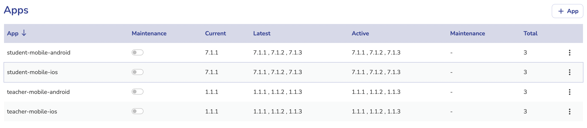
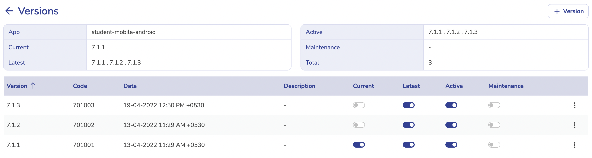

# Versions & Manintenance

The Maintenance Web Panel is used to manage the **Versioning** and **Maintenance** of All the **User Platforms** (Web and Mobile Apps). It allows to put any user platform into **maintenance** and manage **latest** and **active** **versions**.

?> The Applications and Versions maintained in the Maintenance Panel are centrally shared between all micro-services (API servers). API services use the maintenance and versions data to authenticate and handle the API requests coming from all the User Platforms.

Link to Web Panel : https://maintenance.saarthipedagogy.com

!> Don't **abuse** the **maintenance** & **versioning** features. It is very important that we handle all platforms without affecting live users.

## Apps

1. Create and Manage All Apps (User Platforms - Web and Mobile Apps) of the system.
1. An App will contain following information :
    - Name (used by the backend service for validating API calls)
1. Carefully create App with appropriate information to avoid issues.

## Versions

1. Apps will have multiple versions.
1. Create and Manage App Versions from App Details Page.
1. A Version will contain following information :
    - Name (Version Name - used by the backend service for validating API calls)
    - Code (Version Code)
    - Description
1. Carefully create Version with appropriate information to avoid issues.

## Maintenance

1. Specific **User Platforms** can be put **In** and **Out** of **Maintenance Mode** as per the requirements.
1. In Addition, **Specific Versions** of Specific User Platforms can also be put in Maintenance Mode.
1. Reasons of putting Platforms in Maintenance can be as following :
    - Putting Updates with Breaking Changes in the Applications.
    - Maintenance of Servers or Infrastructures are going on.
    - Some critical bugs are found and we want to prevent users from accessing the applications.
    - We want to prevent users from accessing the platform for any other reasons.
    - A singe Version has some critical bug and we want to prevent users from using that version only.

### App Maintenance

Turn Specific Application's Maintenance Mode On/Off by clicking the Switch in front of Application Name, in Apps List Screen.

**Effects :**

-   If the Maintenance is On,
    -   Users will see Maintenance Message in the app.
    -   User will not be able to perform any action in the app.
-   If the Maintenance is turned Off, Maintenance Message will automatically close.
    -   In Web, System will show Maintenance Completion Message, and show Refresh Page Button - it will close the message and take user to home page
    -   In Mobile, System will show Maintenance Completion Message, and show Close Button - it will close the message

### Version Maintenance

Turn Specific Application's Specific Version's Maintenance Mode On/Off by clicking the Switch in front of version name, in Versions List Screen.

**Effects :**

-   Version Maintenance effects will be same as the application maintenance, but for this specific version only.

## Version Status Change

### Current Version

Current Version is a single Version which is the live in production (latest) of the specific application.

?> This version should be the same as the live Play Store / App Store Versions.

!> Make sure only one version is set to current at a time.

Turn Specific Application's Specific Version's Current Mode On/Off by clicking the Switch in front of version name, in Versions List Screen.

**Effects :**

-   This version is shown to users in the update messages.
-   Users of this version will not be shown any update messages.

### Latest Versions

Latest Version are versions which are the live in production (latest) of the specific application, and do not require any updation.

?> Generally there will be only single version marked as Latest, but while putting updates, we can mark new versions as latest as well. To avoid version update messages.

### Active Versions
