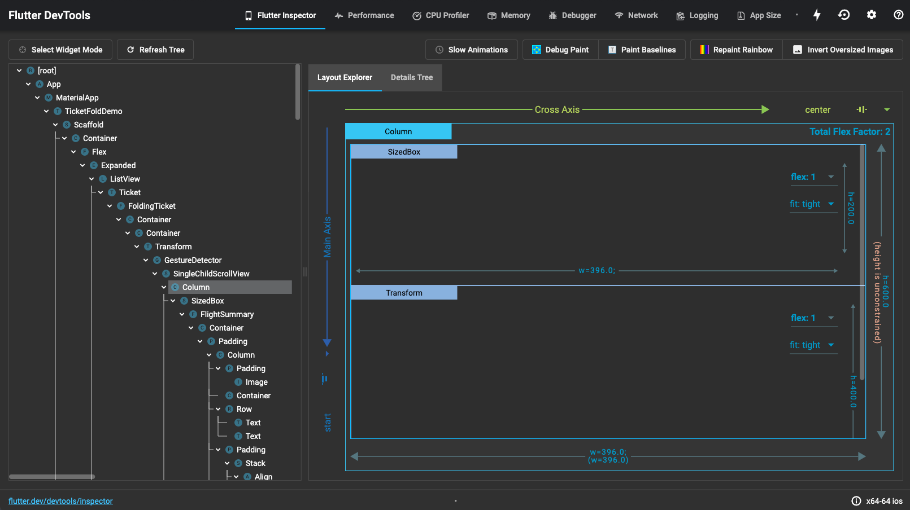
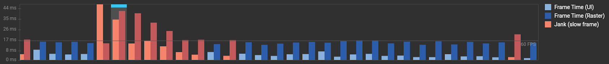
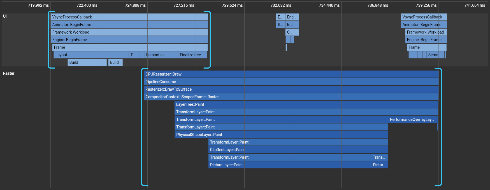
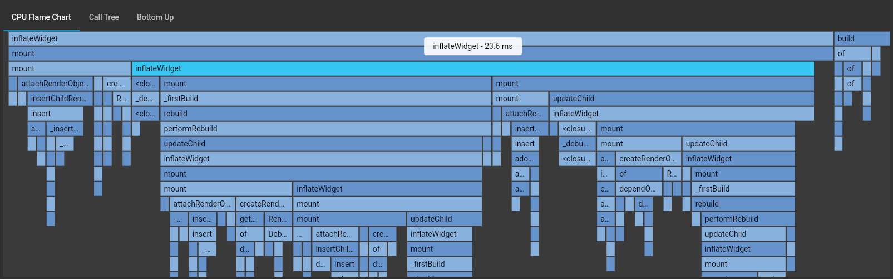
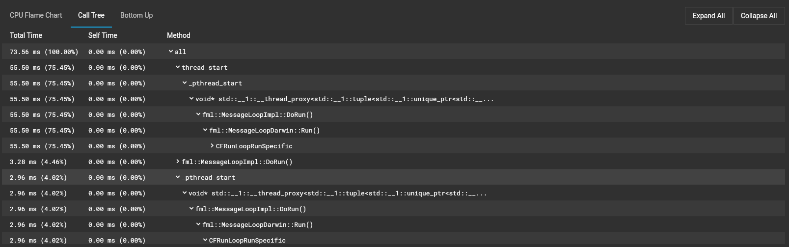
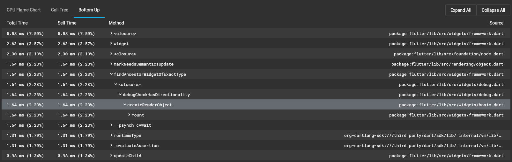
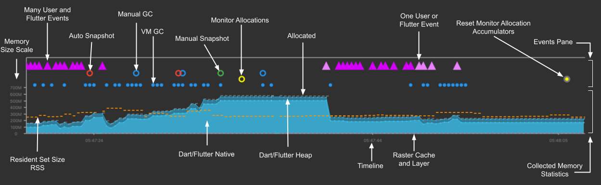
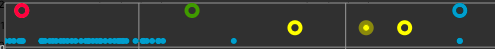
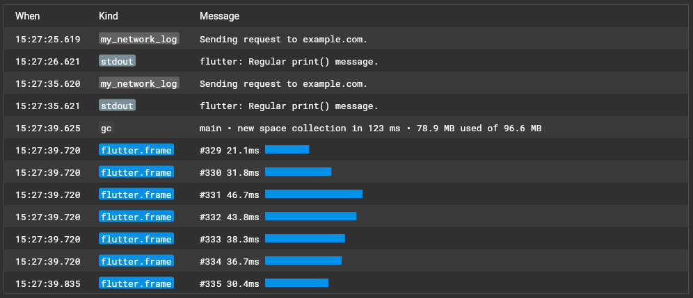
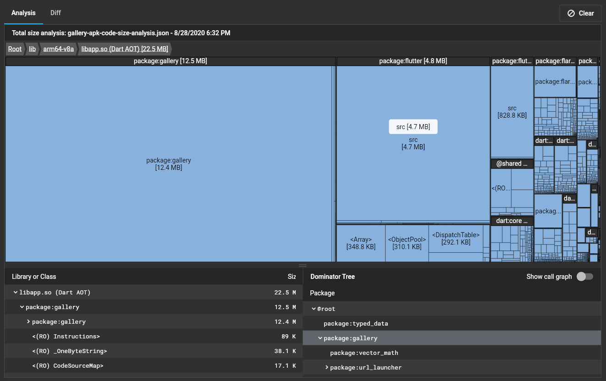

# Flutter Dev Tools

DevTools is a suite of **performance** and **debugging** tools for Dart and Flutter.
Dev Tools provide you:

-   Inspect the UI layout and state of a Flutter app.
-   Diagnose UI jank performance issues in a Flutter app.
-   CPU profiling for a Flutter or Dart app.
-   Network profiling for a Flutter app.
-   Source-level debugging of a Flutter or Dart app.
-   Debug memory issues in a Flutter or Dart command-line app.
-   View general log and diagnostics information about a running Flutter or Dart command-line app.
-   Analyze code and app size.

Tools covered under Dev Tools suite are:

-   [Flutter Inspector](#flutter-inspector)
-   [Performance View](#performance-view)
-   [CPU Profile](#cpu-profile)
-   [Memory View](#memory-view)
-   [Network View](#network-view)
-   [Logging View](#logging-view)
-   [App Size Tool](#app-size-tool)

### Flutter Inspector

The Flutter widget inspector is a powerful tool for visualizing and exploring Flutter widget trees. The Flutter framework uses widgets as the core building block for anything from controls (such as text, buttons, and toggles), to layout (such as centering, padding, rows, and columns). The inspector helps visualize and explore Flutter widget trees, and can be used for the following:

-   understanding existing layouts
-   diagnosing layout issues

**Inspector Menu Items:**

-   **Select widget mode icon:** Enable this button in order to select a widget on the device to inspect it.
-   **Refresh Tree:** Reload the current widget info.
-   **Slow animations:** Run animations 5 times slower to help fine-tune them.
-   **Show guidelines:** Overlay guidelines to assist with fixing layout issues.
-   **Show baselines:** Show baselines, which are used for aligning text. Can be useful for checking if text is aligned.
-   **Highlight repaints:** Show borders that change color when elements repaint. Useful for finding unnecessary repaints.
-   **Highlight oversized images:** Highlights images that are using too much memory by inverting colors and flipping them.

### Performance View

The performance view offers timing and performance information for activity in your application. It consists of three parts, each increasing in granularity.

-   Flutter frames chart (Flutter apps only)
-   Timeline events chart

**Frames Chart**
This chart contains Flutter frame information for your application. Each bar set in the chart represents a single Flutter frame. The bars are color-coded to highlight the different portions of work that occur when rendering a Flutter frame: work from the UI thread and work from the raster thread (previously known as the GPU thread).

Selecting a bar from this chart centers the flame chart below on the timeline events corresponding to the selected Flutter frame. The events are highlighted with blue brackets.

**UI**
The UI thread executes Dart code in the Dart VM. This includes code from your application as well as the Flutter framework. When your app creates and displays a scene, the UI thread creates a layer tree, a lightweight object containing device-agnostic painting commands, and sends the layer tree to the raster thread to be rendered on the device. 
**Raster**
The raster thread (previously known as the GPU thread) executes graphics code from the Flutter Engine. This thread takes the layer tree and displays it by talking to the GPU (graphic processing unit). You cannot directly access the raster thread or its data, but if this thread is slow, it’s a result of something you’ve done in the Dart code. Skia, the graphics library, runs on this thread. 
**Jank (slow frame)**
The frame rendering chart shows jank with a red overlay. A frame is considered to be janky if it takes more than ~16 ms to complete (for 60 FPS devices). To achieve a frame rendering rate of 60 FPS (frames per second), each frame must render in ~16 ms or less. When this target is missed, you may experience UI jank or dropped frames. 
**Shader Compilation**
Shader compilation occurs when a shader is first used in your Flutter app. Frames that perform shader compilation are marked in dark red.

### CPU Profiler

The CPU profiler view allows you to record and profile a session from your Dart or Flutter application. Start recording a CPU profile by clicking Record. When you are done recording, click Stop. At this point, CPU profiling data is pulled from the VM and displayed in the profiler views (Call Tree, Bottom Up, and Flame Chart).

**Flame Chart** This tab of the profiler shows CPU samples for the recorded duration. This chart should be viewed as a top-down stack trace, where the top-most stack frame calls the one below it. The width of each stack frame represents the amount of time it consumed the CPU. Stack frames that consume a lot of CPU time might be a good place to look for possible performance improvements. 

**Call tree** The call tree view shows the method trace for the CPU profile. This table is a top-down representation of the profile, meaning that a method can be expanded to show its callees.

**BottomUp** The bottom up view shows the method trace for the CPU profile but, as the name suggests, it’s a bottom-up representation of the profile. This means that each top-level method in the table is actually the last method in the call stack for a given CPU sample (in other words, it’s the leaf node for the sample).

### Memory View

Allocated Dart objects created using a class constructor (for example, by using new MyClass() or MyClass()) live in a portion of memory called the heap. The memory in the heap is managed by the Dart VM (virtual machine). The DevTools Memory page lets you peek at how an isolate is using memory at a given moment. It enables:

-   Charting memory usage statistics and events
-   Analysis to view all memory via a heap to detect memory issues and inspect objects
-   Monitoring and tracking allocations and their stack traces for selected classes.  
    
    **Memory anatomy** A timeseries graph is used to visualize the state of the Flutter memory at successive intervals of time. Each data point on the chart corresponds to the timestamp (x-axis) of measured quantities (y-axis) of the heap. For example, usage, capacity, external, garbage collection, and resident set size are captured. 
    At the top-level, when the Memory tab is selected, memory statistics from the VM are collected and displayed in the two overview charts (Dart memory and Android only). The collected statistics include general memory usage, such as total heap used, external heap size, maximum heap capacity, and Resident Set Size (RSS). As you interact with your application, various events are detected and collected in the same timeline as the memory statistics, such as memory GC (garabage collection), Flutter events, and user-fired events (using the dart:developer package). All of these collected statistics and events are displayed in charts. 
    **Analysis & Snapshots** A snapshot is a complete view of all objects in the Dart memory heap. Each time a snapshot is taken, a complex and time consuming analysis is performed over the collected memory data. The memory profiler attempts to identify any memory patterns that might cause leaks or lead to application crashes. For example, loading large assets for images displayed as thumbnails—memory usage can be improved by loading smaller assets or adjusting the cacheWidth and cacheHeight to decode an image to a smaller size 
    **Events Pane** The event timeline displays Dart VM and DevTools events on a shared timeline. These events can be snapshots (manual and auto), Dart VM GCs, user requested GCs, or monitor and accumulator reset actions.
     
    This chart displays DevTools events (such as manual GC, VM GC, snapshot, monitor Allocations Track and Reset of accumulators button clicks) in relation to the memory chart timeline. Clicking over the markers in the Event timeline displays a hover card of the time when the event occurred. This might help identify when a memory leak has possibly occurred in the timeline (x-axis).

### Network View

The network view allows you to inspect HTTP, HTTPS, and web socket traffic from your Dart or Flutter application.

Network traffic should be recording by default when you open the Network page. If it is not, click the Record network traffic button in the upper left to begin polling. Select a network request from the table (left) to view details (right). You can inspect general and timing information about the request, as well as the content of response and request headers and bodies.

### Logging View

The logging view displays events from the Dart runtime, application frameworks (like Flutter), and application-level logging events. 
The logging view shows:

-   Garbage collection events from the Dart runtime
-   Flutter framework events, like frame creation events
-   stdout and stderr from applications
-   Custom logging events from applications

### App Size Tool

The app size tool allows you to analyze the total size of your app. You can view a single snapshot of “size information” using the Analysis tab, or compare two different snapshots of “size information” using the Diff tab. 
“Size information” contains size data for Dart code, native code, and non-code elements of your app, like the application package, assets and fonts. A “size information” file contains data for the total picture of your application size. 
The Dart AOT compiler performs tree-shaking on your code when compiling your application. This means that the compiler attempts to optimize your app’s size by removing pieces of code that are unused or unreachable. 
After the compiler optimizes your code as much as it can, the end result can be summarized as the collection of packages, libraries, classes, and functions that exist in the binary output, along with their size in bytes. This is the Dart portion of “size information” we can analyze in the app size tool to further optimize Dart code and track down size issues.

The analysis tab allows you to inspect a single snapshot of size information. You can view the hierarchical structure of the size data using the treemap and table, and you can view code attribution data (for example, why a piece of code is included in your compiled application) using the dominator tree and call graph.
