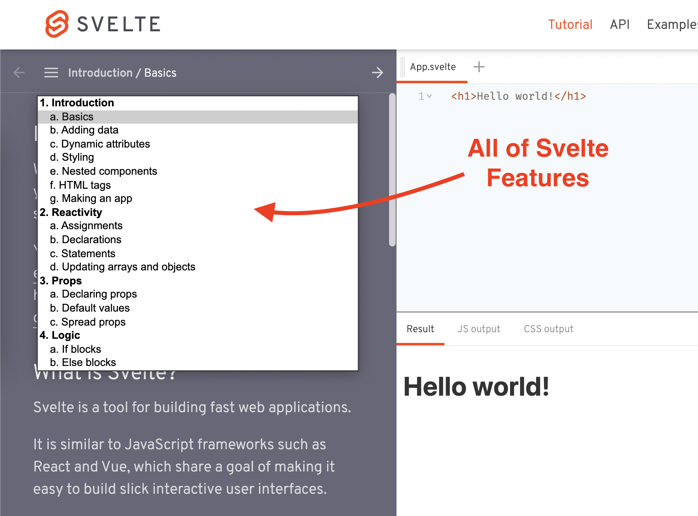

# Svelte Interactive Tutorial

Checkout Svelte Tutorial here : https://svelte.dev/tutorial

> A very interesting thing about Svelte is, they made a great `interactive programming tutorial` which covers all the features of Svelte. You don't need to do any `Online Courses` to learn Svelte. It is all in their webiste. Easy to learn.

?> Interactive Programming is the best way to learn Programming. 
I hope one day you will build such thing for Groupla.

---

---

## Features

1. All the major features of Svelte are included in the tutorial.
1. Interactive Programming - `Instructions` -> `Code` -> `Output`
1. Show Solution if you cannot follow the instructions.
1. `Chapter & Topics` Structure.

!> **Important** It is not recommended to view the result without trying to solve it first.
