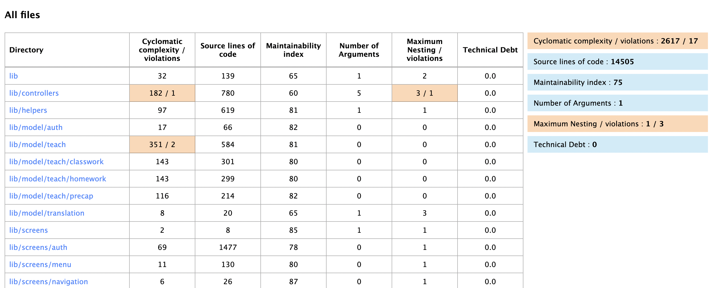

# [Dart Code Metrics](https://dartcodemetrics.dev/)

Dart Code Metrics is a static analysis tool that helps you analyse and improve your code quality. It checks for anti-patterns and reports code metrics to help you monitor the quality of your code and improve it.

-   [Key Features](#key-features)
-   [Code Quality Rules](#code-quality-rules)
-   [Code Metrics](#code-metrics)
-   [Anti-Patterns](#anti-patterns)
-   [Configurations](#configurations)
-   [Command Line Interface](#command-line-interface)
-   [Rules Shortlist](#rules-shortlist)

### Key Features:

-   Unused files identification
-   Unused code identification
-   Automated Code Quality Validation

### Code Quality Rules

-   Analyzes each line of code and identifies specific lines of code where code quality rule failed along with the type of rule failed.
-   Ability to choose and apply rules which makes sense for the dev team.
-   Ability to configure the severity level of each rule and report them as either style, performance, warning, or error.
-   List of possible metrics and underlying validations can be found [here](https://dartcodemetrics.dev/docs/rules/overview).

### Code Metrics

-   Code Quality Standard Quantifiable Rules which are configurable.
-   Ability to define which metric apply vs. which don’t so a team can focus on what metrics matters to them rather than trying to fix all rules.
-   Quantifiable Rules to check code base, generate metrics and validate against configured threshold levels against each rule.
-   Ability to customize metrics threshold. For example, Cyclomatic complexity violation could be configured with threshold factor of 20 or 30 implying the rule is considered violated if the cyclomatic complexity of any method goes beyond the threshold limit which is configurable.
-   Reporting metrics available in JSON, HTML, plain text etc. formats.
-   List of possible metrics and underlying validations can be found [here](https://dartcodemetrics.dev/docs/metrics/overview).

### Anti-Patterns

Identifies long methods and long Parameter Lists which are recommended to be refactored and simplified. More details [here](https://dartcodemetrics.dev/docs/anti-patterns/overview).

### Configurations

-   Add `pubspec.yaml` entry to add code metrics plugin: <br>
    `$ flutter pub add --dev dart_code_metrics`

-   To configure the package add a `dart_code_metrics` entry to `analysis_options.yaml`. This configuration is used by both CLI and the analyzer plugin. <br>

Sample code metrics rule configuration

```
dart_code_metrics:
  anti-patterns:
    - long-method
    - long-parameter-list
  metrics:
    cyclomatic-complexity: 20
    maximum-nesting-level: 5
    number-of-parameters: 4
    source-lines-of-code: 50
  metrics-exclude:
    - test/**
  rules:
    - newline-before-return
    - no-boolean-literal-compare
    - no-empty-block
    - prefer-trailing-comma
    - prefer-conditional-expressions
    - no-equal-then-else

```

-   Find More details [here](https://dartcodemetrics.dev/docs/getting-started/configuration)

### Command Line Interface

Following is the command line statement which can be used to run the code metrics tool. <br>

`flutter pub run dart_code_metrics:metrics <command> lib` <br>

**Available Commands:**

-   `analyze`: Reports code metrics, rules and anti-patterns violations.
-   `check-unused-files`: Checks unused \*.dart files.
-   `check-unused-code`: Checks unused code in \*.dart files.

**Analyze Code**

-   Following is the sample output of code metrics analysis on console

```
$ flutter pub run dart_code_metrics:metrics analyze lib

WARNING Prefer trailing comma.
        lib/screens/teach/classwork/submission.dart:460:13
        prefer-trailing-comma : https://dartcodemetrics.dev/docs/rules/common/prefer-trailing-comma

WARNING Prefer trailing comma.
        lib/screens/teach/classwork/submission.dart:474:19
        prefer-trailing-comma : https://dartcodemetrics.dev/docs/rules/common/prefer-trailing-comma

WARNING Then and else branches are equal.
        lib/screens/teach/classwork/submission.dart:478:25
        no-equal-then-else : https://dartcodemetrics.dev/docs/rules/common/no-equal-then-else

ALARM   StudentSubmissionCard.build
        cyclomatic complexity: 54


lib/screens/teach/classwork/upload_classwork_2.dart:
STYLE   Block is empty. Empty blocks are often indicators of missing code.
        lib/screens/teach/classwork/upload_classwork_2.dart:88:68
        no-empty-block : https://dartcodemetrics.dev/docs/rules/common/no-empty-block
```

-   Following is the sample out of code metrics analysis to html

```
//  Below command creates metrics folder in project root
flutter pub run dart_code_metrics:metrics analyze lib --reporter=html
```



**Check Unused Files Output** Identifies each gile under lib which is unused.

```
$ flutter pub run dart_code_metrics:metrics check-unused-files lib
⚠ unused file: lib/helpers/custom_classes.dart
⚠ unused file: lib/helpers/measured_size.dart
⚠ unused file: lib/helpers/routes.dart
⚠ unused file: lib/screens/home.dart
⚠ unused file: lib/screens/test/test.dart
⚠ unused file: lib/screens/worksheet/worksheet.dart
⚠ unused file: lib/widgets/common/circular_gradient_btn.dart
⚠ unused file: lib/widgets/roadmap/no_animation_material_page_route.dart
```

**Check Unused Code Output:** Identifies each line of code which is unused.

```
$ flutter pub run dart_code_metrics:metrics check-unused-code lib
lib/helpers/constant.dart:
    ⚠ unused top level variable noImagePlaceholder
      at lib/helpers/constant.dart:4:1
    ⚠ unused top level variable termsConditionRoute
      at lib/helpers/constant.dart:6:1
    ⚠ unused top level variable worksheetRoute
      at lib/helpers/constant.dart:7:1

lib/model/auth/user.dart:
    ⚠ unused function userModalFromJson
      at lib/model/auth/user.dart:7:1
    ⚠ unused function userModalToJson
      at lib/model/auth/user.dart:9:1

lib/model/teach/classwork/classwork.dart:
    ⚠ unused function classworkModalToJson
      at lib/model/teach/classwork/classwork.dart:9:1
....
```

**Supported Formats:**

Report from Code Metrics plugin can be output in any one of the following formats:

-   Console
-   GitHub
-   Checkstyle
-   Codeclimate
-   HTML
-   JSON

**Rules Shortlist**

Following rules have been shortlisted to be applied and must be fixed before pushing the code to git. More details about individual rules and metrics can be found [here](https://dartcodemetrics.dev/docs/rules/overview).

| Rule          | Description                                                                                      |
| ------------- | ------------------------------------------------------------------------------------------------ |
| avoid-dynamic | Warns when dynamic type is used as variable type in declaration, return type of a function, etc. |
| TBD           | Add rules post review                                                                            |
